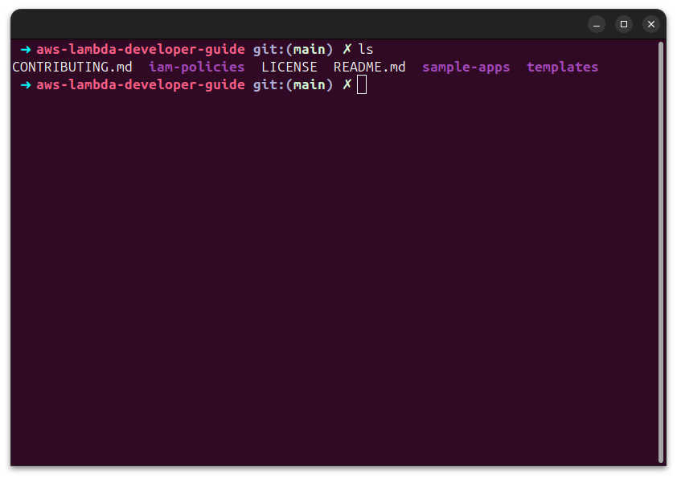
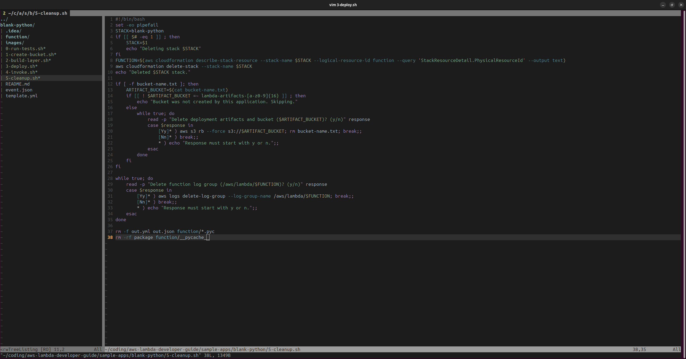
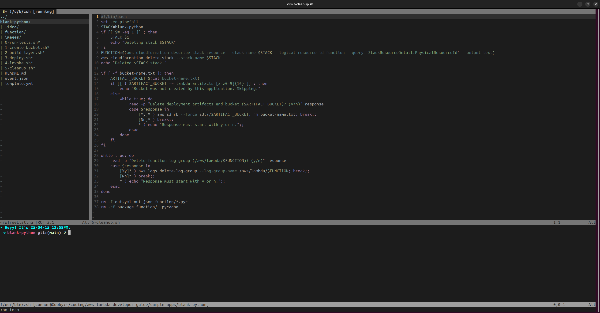

This repo is where I'm throwing config stuff that I want to re-use across multiple computers (work, home, remote).

# Custom zsh template

This theme is basically just the default theme for oh-my-zsh "robbyrussel" but with some custom colours and a "sysmsg" function that sends out a quick message on startup and exit.

You can download and use this by putting the theme in your custom themes directory and changing `ZSH_THEME` in your ~/.zshrc file to "connor". By default the custom themes directory is `.oh-my-zsh/custom/themes/`, so that's where it'll be if you haven't configured it!

Here is a decent idea of how this looks:



# vimrc
This also contains my .vimrc file! To use it, either replace the vimrc file in your default location or set up an alias to run 

```
vim -u /path/here/zsh_custom/.vimrc
``` 

or set up a symlink if you don't want .vimrc in your home directory:

```
cd ~
ln -s /path/here/zsh_custom/.vimrc .vimrc
```

It's pretty rudimentary by intention.  I'm going for "this is really good compared to nano" and not "I'm replacing my IDE with this!". I am tempted, but I'm not interested in the upfront investment of hard switching to vim, I'll continue using it for the tasks that I use nano for (which is still a lot of what I do) and improving this .vimrc as I go. If it gets to a point where I'm tired of vscode and would prefer this then I'll make the switch, but there's a chance that I would just enable vim motions in vscode if I felt that strongly about it.

Either way, don't expect a great vim configuration here!



As a convenience feature, I've made it so that using `ctrl` with an arrow-key (e.g. `ctrl-left`/`ctrl-right`) will switch between splits in the same tab. You can still use `ctrl-W` but I prefer this.
I've also added `:qt` to close a full tab (includes all splits) since I'm abusing the way tabs work here in order to get a pseudo-project drawer out of `:Lexplore`.

I also threw in an abbreviated command to open a terminal. Running :bterm will open a terminal across the bottom, similar to an IDE:




## Notes
The project drawer opens to wherever the terminal window is. I like this for now, but I might change this to open to the directory of the current file when starting Vim? unsure which is better for me atm, I like the idea of being in a directory with my scripts and editing files elsewhere with vim, so idk if I'd want to see the scripts in my sidebar by default or the folder where I'm editing by default and i've gone with the former.

Also added an inputrc file to make the up/down arrows search for the most recent command matching the text you've already input, rather than always going to the last command - similar to macs. Load it with:

```
bind -f <path-to-here>/.inputrc
```

